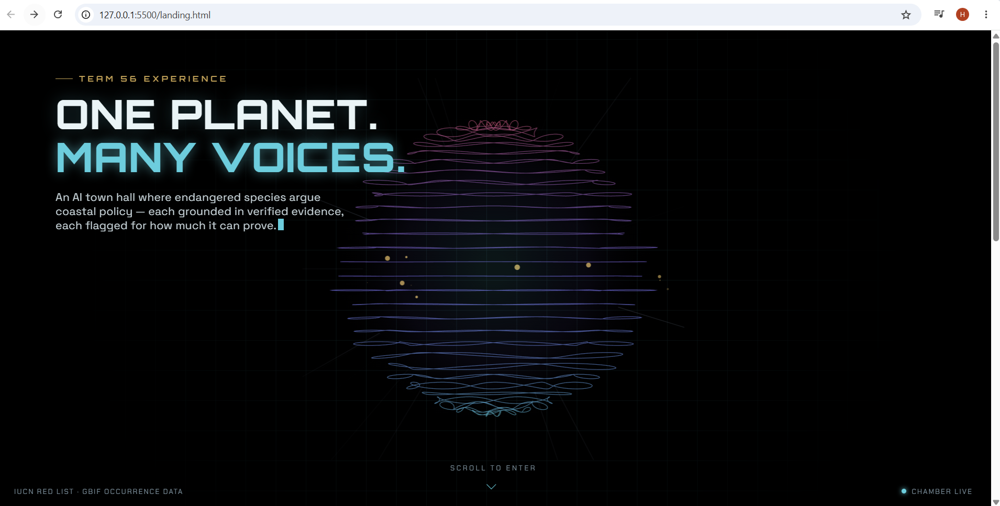
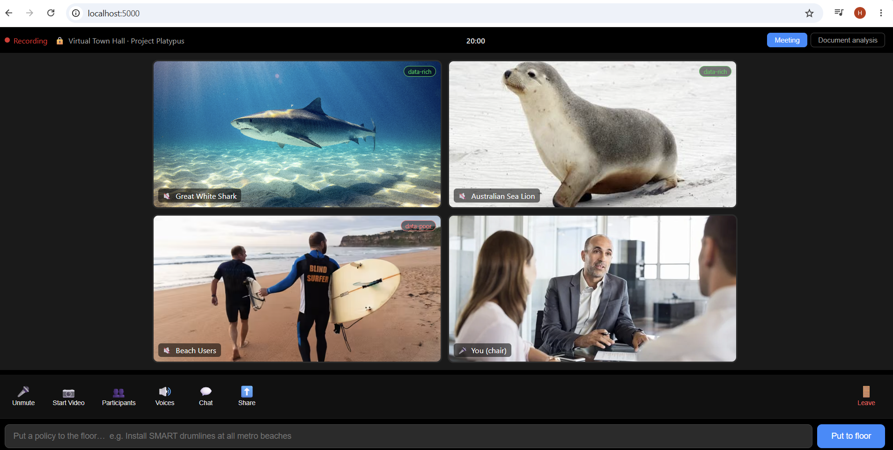
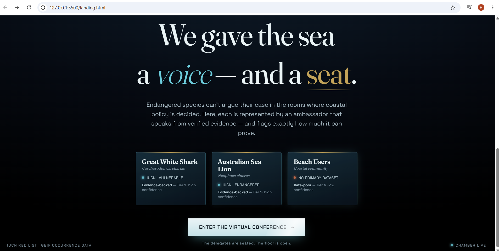
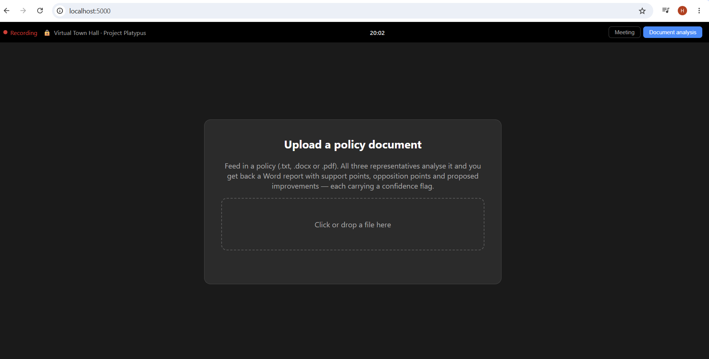

# Project Platypus — Virtual Town Hall (Demo Track)

**Team 56 · Monash–Warwick Alliance × Pluraversal Services**

An AI-mediated "town hall" where non-human species are given a seat at the policy table. Each species is represented by an ambassador — modelled on a UN ambassador — that argues for its constituency's interests in coastal policy decisions. This repository is the demonstration track: a working web app showing multi-species interaction and document analysis.



## Core design principle

> **AI phrases the arguments. The evidence speaks the facts.**

Every factual claim a representative makes is drawn from a verified evidence base (IUCN Red List + GBIF occurrence data), not from the language model's own knowledge. The model (Gemini) is only allowed to phrase a position using the facts supplied to it. Each fact is tagged with a confidence tier, so weak evidence is surfaced transparently rather than hidden.

Representatives argue purely from self-interest. Conflict between them is intentional and is left unresolved at the representative level — resolution is a job for the system layer above the ambassadors, never inside one.

## The representatives

|  | Representative | Scientific name | Type | Data status | IUCN status |
|---|---|---|---|---|---|
|  | Great White Shark | *Carcharodon carcharias* | species | data-rich | Vulnerable |
|  | Australian Sea Lion | *Neophoca cinerea* | species | data-rich | Endangered |
|  | Beach Users | — | community | data-poor | — |

**Beach Users** is deliberately data-poor. Human community interests have no equivalent to IUCN or GBIF, so this constituency carries low-confidence, low-tier evidence. It is included on purpose to demonstrate that the system flags evidence quality instead of dressing up a weak claim as a strong one.

## Features

- **Meeting screen** — a Zoom-style call interface. Put a policy "to the floor" (typed or spoken via microphone) and each representative responds in character, grounded in its evidence base.
- **Spoken responses** — each representative is read aloud with a distinct browser voice; the active speaker's tile lights up.
- **Participants & Chat panels** — live roster and a chat log with a "send as" dropdown so you can post as any representative.
- **Document analysis** — upload a policy document (`.txt`, `.docx`, `.pdf`) and every representative analyses it. Returns a Word (`.docx`) report with support points, opposition points, and proposed improvements, each carrying a confidence flag and evidence basis.





## Project structure

| File | Purpose |
|---|---|
| `server.py` | Flask backend — live replies (`/api/respond`) and document analysis (`/api/analyse`) |
| `build_evidence.py` | Pulls live GBIF occurrence counts + IUCN facts, writes `evidence.json` |
| `evidence.json` | The verified fact base (generated — see below) |
| `index.html` | Zoom-style front end (meeting + document tabs) |
| `START_WINDOWS.bat` | One-click Windows launcher |
| `requirements.txt` | Python dependencies |
| `Test Documents/` | Sample policy documents for testing analysis |
| `docs/` | Screenshots used in this README |
| `*.jpg` | Tile photos for each representative |

The repository also contains earlier exploratory artifacts (`shark.glb`, `shark_3d_realmodel.html`, `shark_advocate.pptx`, `shark_data_proof.ipynb`, `council_landing.html`, `townhall-llm.jsx`) kept for reference; the live demo runs from `server.py` + `index.html`.

## Setup

### 1. Get a Gemini API key

Create a free key at https://aistudio.google.com.

### 2. Provide the key as an environment variable

Do **not** paste your key into `server.py` and commit it. The server reads it from the `GEMINI_API_KEY` environment variable.

**Windows (PowerShell):**

```powershell
setx GEMINI_API_KEY "your-key-here"
```

Then open a new terminal so the variable takes effect.

**macOS / Linux:**

```bash
export GEMINI_API_KEY="your-key-here"
```

### 3. Install dependencies

```bash
py -m pip install -r requirements.txt
```

(On Windows, Python is usually `py`, not `python`.)

If there is no `requirements.txt`, install directly:

```bash
py -m pip install flask google-generativeai python-docx pdfplumber requests
```

### 4. Build the evidence base

```bash
py build_evidence.py
```

This pulls live GBIF counts and writes `evidence.json`.

### 5. Run

```bash
py server.py
```

Then open http://localhost:5000.

On Windows you can instead double-click `START_WINDOWS.bat`, which installs dependencies, builds the evidence base, and starts the server.

On startup the server prints the list of Gemini models your key can actually use. If the configured model is unavailable, edit `PRIMARY_MODEL` near the top of `server.py` to one of the listed names (a flash-lite model is recommended for the largest free daily quota).

## Testing document analysis

Sample documents are provided in `Test Documents/`:

- **Short single-issue policy** — quick check that a document goes in and a report comes back.
- **Multi-section coastal plan** — exercises multi-chunk analysis; each representative should react differently to different sections.
- **Confidence stress test** — full of unsupported claims, to verify the confidence-flagging surfaces low-confidence assessments.

Open the Document analysis tab, drop a file, and a `policy_analysis.docx` report downloads.



## Example policies to put to the floor

- Install SMART drumlines at all metro beaches *(clean three-way split)*
- Ban commercial fishing within 50km of sea lion breeding colonies
- Reduce funding for shark population monitoring to pay for more patrols *(highlights the data-poor vs data-rich confidence contrast)*

Keep them short and declarative, like a motion on the floor.

## Notes & known limitations

- **Free-tier rate limits.** The free Gemini tier is capped per minute and per day. Each policy round is one request per representative; document analysis is several. The server spaces requests out, retries on rate-limit errors, and falls back through a list of models, but heavy use can still exhaust the daily quota. Test sparingly before a live demo.
- **Grounding is prompt-enforced, not hard-locked.** The model is strongly instructed to use only the supplied evidence, but this is not a programmatic guarantee against drift. Verifying emitted facts against `evidence.json` is a natural next step.
- **Browser support.** Microphone input and spoken responses use the Web Speech API — use Chrome or Edge.
- **Not integrated with real Zoom.** The interface is a Zoom-*style* front end. Real Zoom media integration requires Zoom's paid Developer Pack (RTMS) and app approval, which is out of scope for this demo.

## Security

- Never commit your API key. Use the `GEMINI_API_KEY` environment variable.
- If a key has ever been committed, rotate it in Google AI Studio — keys remain recoverable from git history even after being removed from the file.

## Data sources

- **IUCN Red List** — conservation status and population figures
- **GBIF Occurrence API** — live georeferenced sighting counts
- **python-docx** — native Word report generation
